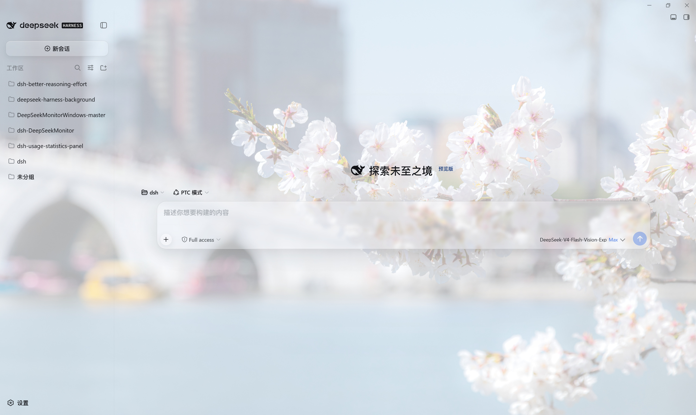
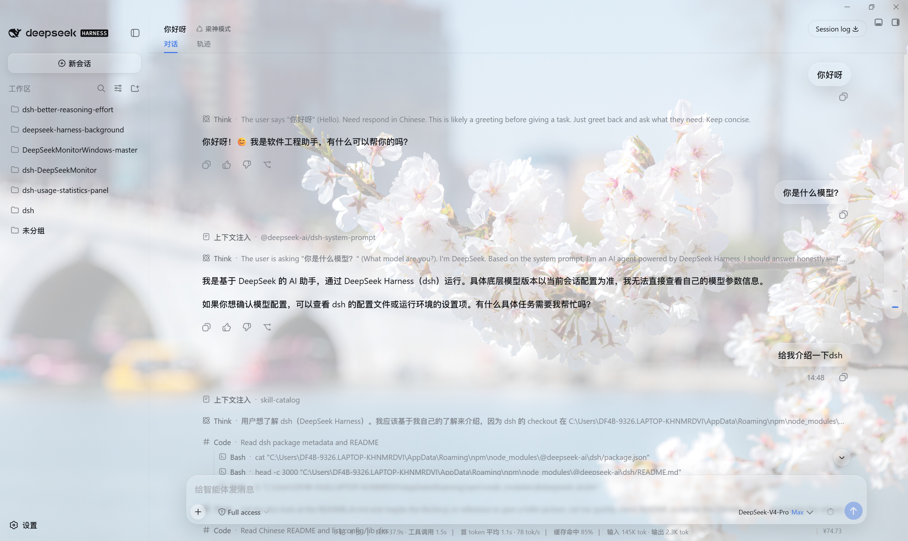
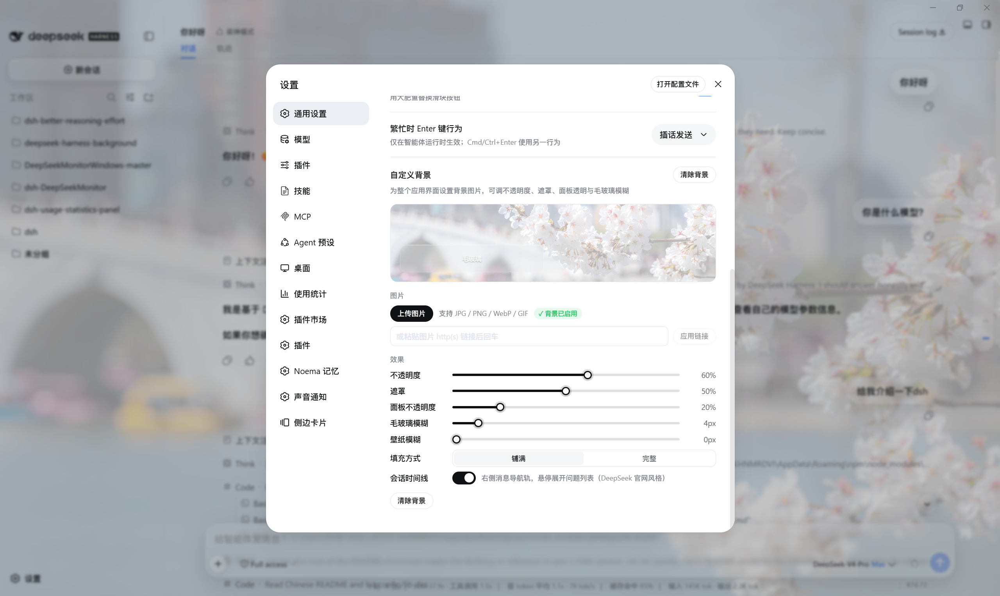

<p align="center">
  <picture>
    <source media="(prefers-color-scheme: dark)" srcset="docs/banner-zh-dark.svg">
    
  </picture>
</p>

# DeepSeek Harness Background

[](https://github.com/awesome-dsh-plugin/awesome-dsh-plugin)
[](https://github.com/HaoyueQin/deepseek-harness-background/stargazers)
[](https://github.com/HaoyueQin/deepseek-harness-background/releases)
[](https://www.npmjs.com/package/deepseek-harness-background)
[](https://www.npmjs.com/package/deepseek-harness-background)
[](https://github.com/HaoyueQin/deepseek-harness-background/actions)
[](https://github.com/HaoyueQin/deepseek-harness-background/issues)
[](https://github.com/HaoyueQin/deepseek-harness-background/commits)
[](https://github.com/HaoyueQin/deepseek-harness-background/graphs/commit-activity)
[](https://github.com/HaoyueQin/deepseek-harness-background)
[](https://github.com/HaoyueQin/deepseek-harness-background)
[](LICENSE)

[English](README.md) | 中文

一个 **DeepSeek Harness Web GUI**（`dsh web`）的**自定义背景图片插件**：上传一张本地图片，或粘贴一个图片链接，把它绘制在整个应用界面背后，并可调节**不透明度**、**可读性遮罩**、**面板透明**与**毛玻璃模糊** —— 全部在设置面板内实时预览、松手自动保存。

外观（固定壁纸层 + 主题自适应遮罩 + 由 `--dsw-*` 设计 token 驱动的半透明玻璃面板）借鉴了社区 `dsh-wallpaper-engine` 的实现。

<p align="center">
  
</p>

## 截图

|  |  |
| --- | --- |
| **首页** |  |
| **会话界面** |  |
| **设置界面** |  |

## 功能

- **本地上传** —— 从电脑选择 JPG / PNG / WebP / GIF 图片；插件存入 harness home 目录，经同源路由提供（仅当声明的 MIME、探测到的文件签名与扩展名三者一致才被接受）。
- **粘贴 URL** —— 输入 `http(s)` 图片链接后回车即可。
- **面板内实时预览** —— 设置行顶部有预览卡：图片 + 遮罩 + 毛玻璃气泡；拖动任意滑块即时重绘，所见即所存。
- **阻尼滑块** —— 比例类滑块按 **5% 步进**、模糊类按 1/2px 步进吸附；拖动过程只改画面，**松手才保存**（每次手势一次写入，不再抖动）。
- **五个调节项** —— 壁纸不透明度、可读性遮罩、面板不透明度、毛玻璃模糊、壁纸模糊。
- **填充方式** —— `cover`（铺满、裁剪）或 `contain`（完整、留白）。
- **主题自适应遮罩** —— 浅色主题用白色纱帘（把图片提亮保持深色文字对比度），深色主题自动换成黑色纱帘（压暗图片保持浅色文字对比度）。
- **毛玻璃（白名单制）** —— 启用背景后，只有以小卡片/小按钮形态悬浮在壁纸上的表面才会变成半透明玻璃（顶部白色高光渐变 + `backdrop-filter`）：输入框卡片与消息气泡、代码块 / 终端 / diff / 工具 IO 卡 / 技能与 MCP 调用卡与行内代码、agent 任务条及其接管面板（审批 / 提问 / 计划评审）、三个铬件按钮（新会话、输入框加号、回到底部）、「加载更早」历史按钮、标题栏展开的子代理列表面板、侧栏构建徽标，以及首页右上角的「预览版」徽标——每块玻璃面都带完整配方（填充 + 高光 + 模糊），绝无"只透明不磨砂"的残缺面。阅读型表面——对话框、设置界面、菜单、Tooltip、Toast、悬停填充与所有强调色（发送键保持品牌蓝）——一律保留**官方不透明样式**，保证可读性（唯一例外：时间线导航轨的悬浮预览卡，它是画在壁纸上的导航铬件，加入玻璃配方）。模糊半径由「毛玻璃模糊」滑块驱动；「面板不透明度」调至 100% 时白名单表面也恢复官方原样。
- **第三方毛玻璃接口** —— 内置毛玻璃注册表（`window.__DSH_BACKGROUND_GLASS__` 全局 + `dsh-background-glass:ready` 事件）：任何插件都可把自家面板的选择器注册进来，套上与内置表面完全一致的配方——`token` 模式为已使用被覆盖 `--dsw-*` 填充的面板补齐高光+模糊链，`fill` 模式连填充一并接管；规则统一挂在 `data-dsh-bg-glass` 门控下随玻璃自动开关。消费方零依赖、未安装本插件时优雅降级，本插件卸载时整桥拆除。详见 [docs/GLASS_API.zh.md](docs/GLASS_API.zh.md)。
- **会话时间线** —— 长会话右缘的 DeepSeek 官网风格轮次导航轨：每一轮一个刻度，悬停或聚焦时预览该轮的问题。 两套前端、同一套后端，按当前内核支持的能力自动选择：   - **dsh ≥ 0.1.2（增强）** —— 内核已经自带这条导航轨，因此插件不渲染任何自己的界面，只修正它的行为： 点击由官方的瞬时跳转改为**平滑滑动**（缓入缓出、按距离定时长、读者一滚动立刻接管、`prefers-reduced-motion` 下直接定位）； 并且当读者把手伸向导航轨时自动往回翻页加载历史，让“需要点加载更多才出现”的轮次也长出刻度、可以直接跳转 —— 补到导航轨自身不压缩的刻度上限为止（再往后官方样式表会把刻度挤成无法瞄准的实心条）。官方悬浮预览卡是实心底，在壁纸门控下改为与输入卡同配方的毛玻璃（受「毛玻璃模糊」滑块驱动）；刻度列加上 DeepSeek 网页版式的上下渐隐（仅绘制层，不影响命中测试）。导航轨的高亮状态仍归内核自己维护——滑动走的是真实滚动容器，官方滚动处理会持续更新活动轮次与持久化滚动位置。   - **dsh ≤ 0.1.1（移植版）** —— 没有官方导航轨，插件渲染自己移植的同一套界面（完全相同的尺寸，同样带上玻璃 + 上下渐隐）， 数据来自同一套后端。 两种情况下，滑动前都会先解除宿主的底部跟随状态（流式增长、轮次结束重渲染都不会把视图拽回底部）；被 rewind 撤回的消息自动从轨道剔除； 历史翻页会补偿前置内容的高度，读者视野纹丝不动。用设置行里的时间线开关可关闭。
- **持久化到官方设置文档** —— 存于 `$DSH_HOME/settings.yaml`，跨重启保留。
- **干净卸载** —— 关闭、清除或卸载后完整恢复原背景；插件只移除自己写过的内容。

## 安装

这是一个标准的 out-of-tree dsh bundle，已发布到 npm：

```sh
dsh plugin --profile web add deepseek-harness-background
```

从本地 checkout 安装（开发用）：

```sh
dsh plugin --profile web add /path/to/deepseek-harness-background
```

从源代码检出安装：

```sh
pnpm dsh plugin --profile web add /path/to/deepseek-harness-background
```

或从 git 安装：

```sh
dsh plugin --profile web add github:<you>/deepseek-harness-background#<commit>
```

安装后重启：

```sh
dsh --profile web
```

## 使用

1. 启动 Web UI（`dsh --profile web`）并在浏览器打开。
2. 打开 **设置**（左下角）→ **通用** → 找到 **自定义背景** 一行（与「外观」行同一区域）。
3. **上传**图片或**粘贴 URL** —— 背景立即生效，面板顶部的预览卡同步显示。
4. 调整控件，滑块均为阻尼步进、**松手才保存**：

| 控件 | 说明 |
| --- | --- |
| 不透明度 | `0..100%` 图片不透明度（5% 步进）；调低让壁纸向表面色淡出。 |
| 遮罩 | `0..95%` 图片上方的可读性纱帘（5% 步进），浅色主题白色、深色主题黑色。 |
| 面板不透明度 | `0..100%` 表面透明程度（5% 步进）；为 `100%` 时官方面板保持不透明（无玻璃）。 |
| 毛玻璃模糊 | `0..40px` 半透明表面上的 `backdrop-filter` 模糊（1px 步进）。 |
| 壁纸模糊 | `0..60px` 壁纸图片本身的模糊（2px 步进）。 |
| 填充方式 | `cover`（铺满）或 `contain`（完整）。 |
| 会话时间线 | 会话时间线的开关（默认开启）。dsh ≥ 0.1.2 上该项显示为**会话时间线增强**：官方导航轨保留，插件只优化其行为，关掉即恢复官方原样；旧内核上该项为**会话时间线**，开关控制插件自己移植的导航轨。 |

5. 点 **清除背景** 移除背景，恢复默认外观。

## 原理

- **设置行**位于官方「通用」设置分区的 `settings.general.item` 槽中，紧挨「外观」行。控件样式全部使用 `--dsw-alias-*` 设计 token（按钮 / 胶囊 / 分段控件 / 滑块轨道与官方 chrome 一致），滑块为原生 `input[type=range]` 的 5% / 1–2px 步进 + 松手提交。
- **会话时间线**注册进 `conversation.input.dock` 槽位（绑定每会话生命周期）。模式判定是对槽位 props 的能力探测，而不是比较版本号： 官方导航轨正是由 `ui-chat` 以会话 hook 形式发布的同一份索引渲染的（`useChat(s => s.navigation.items())`，dsh ≥ 0.1.2）， 所以这个 hook 存在**就是**官方导航轨存在 —— 而且它能扛住预发布版、fork 以及挂载了其它会话目标的部署。 hook 存在时插件什么都不渲染，只在**捕获阶段**拦截官方导航轨的点击（React 18 在冒泡阶段由根容器派发 `onClick`， 所以导航轨上的捕获监听先执行，`stopImmediatePropagation()` 让官方处理器根本收不到事件）；hook 不存在时插件渲染自己移植的导航轨，portal 到 `body`。 两者跑同一个跳转引擎。数据最快的来源是宿主侧会话投影（`bgTimeline`，注册于 `src/projection.ts`）， 它枚举整个会话的每一条用户消息（含会话视图尚未分页载人的轮次），已加载的 chat 节点窗口作为兜底； 该窗口以鸭子类型同时兼容两代内核，因为 0.1.2 把 Chat 快照从 `session.getSnapshot().chat` 迁到了 `useChat()` —— 这是本插件唯一一处破坏性变更。 历史预热只在读者把手伸向导航轨时运行，并停在导航轨不压缩的刻度上限（`floor((高度 - 12) / 10) + 1`）； 每一页都补偿前置内容的高度，因为宿主的 prepend 锚点在插件侧无法触及。移植版导航轨与增强后的官方轨采用完全一致的**玻璃 + 上下渐隐处理** —— 悬浮预览在壁纸门控下加入毛玻璃配方（与输入卡片同一显式填充配方），刻度列带 DeepSeek 网页版式上下渐隐，两个前端对读者的视觉完全一致。
- 插件自有的 host 路由（`/api/bg-wallpaper/*`：`settings`、`upload`、`image/<id>`）负责读写设置与提供上传图片，带同源校验、大小上限、MIME/签名校验与路径穿越防护。使用自定义路由族，是因为 api-proxy 的 settings 白名单不向第三方命名空间开放 settings RPC。
- 背景以 `body` 上一张固定的 `z-index:-2` 壁纸层 + `z-index:-1` 遮罩绘制，由 `data-dsh-bg` 属性开关；遮罩在注入样式表里按 `data-ds-dark-theme` 切换白/黑纱帘。毛玻璃为白名单制：仅对输入/气泡/代码/任务条等白名单表面覆盖 `--dsw-*` surface token，其余表面通过 `data-dsh-bg-glass` 门控的显式规则补齐整套配方（填充 + 高光 + 模糊滤镜链）：三个 chrome 按钮、「加载更早」历史按钮、composer 坞列家族——agent 任务条（TodoPanel / GoalBar / QueueDock）与接管面板（审批 / 提问 / 计划评审，token 变半透明后由这里补上模糊）、子代理列表弹出层、首页「预览版」徽标、侧栏构建徽章——全部官方 token 与阅读型界面（菜单/对话框/tooltip/toast）保持原样。
- **第三方玻璃注册表**（`src/client/glass-registry.ts`）：客户端 apply 时即在 `window.__DSH_BACKGROUND_GLASS__` 发布注册 api 并派发 `dsh-background-glass:ready`；`register({ plugin, selectors, mode })` 按 `(plugin, mode, selector)` 三元组幂等登记，把 `body[data-dsh-bg-glass]` 门控的显式配方规则合成进独立的 `<style data-plugin-css>` 标签；选择器先做结构性校验（禁 `{} ; @ < > ,` 与反斜杠、500 字符上限），违规条目逐条警告并丢弃、不影响兄弟条目；fiber dispose 时整桥拆除（样式表、条目、window 键全清）。契约文档见 `docs/GLASS_API.md` / `GLASS_API.zh.md`，行为由 `tests/glass-registry.spec.ts` 锁定。
- 上传文件存放在 `$DSH_HOME/deepseek-harness-background/`（内容寻址 id）。切换新图片或清除背景时，被替换的旧上传文件会被自动回收，正常使用下目录不会堆积死图片。（例外：上传后从未保存进设置——例如上传后立刻关闭标签页——会留下一个孤儿文件。）关闭 / 卸载后不留残留。

## 开发

```sh
pnpm install          # 首次；会运行 prepare（构建）
pnpm run typecheck    # tsc
pnpm test             # vitest 契约测试
pnpm run build        # tsdown：lib/index.js（host）+ lib/client.js（浏览器 bundle）
```

```
deepseek-harness-background/          # 插件仓库（包名保留 npm 风格 id）
├── package.json          # dsh.bundle.patch + dsh.client.inject 声明
├── cordis.patch.yml      # 向 web 插件名册插入 deepseek-harness-background 一行
├── tsdown.config.ts      # 官方 clientBundle 预设
├── src/
│   ├── index.ts          # host 半部：ui-background 命名空间 + API 路由
│   ├── routes.ts         # /api/bg-wallpaper/{settings,upload,image/<id>}
│   ├── schema.ts         # host 侧 schemastery schema
│   ├── settings.ts       # 两端共享的常量/类型
│   ├── projection.ts     # bgTimeline 会话投影（时间线的全量用户消息索引）
│   ├── harness-home.ts   # $DSH_HOME / ~/.dsh 解析
│   └── client/
│       ├── index.ts          # painter 生命周期 + 设置行注册
│       ├── backdrop.ts       # 固定壁纸层 + 遮罩 + 玻璃表面 + 预览变量
│       ├── background-css.ts # 注入的样式表（层、玻璃、明暗遮罩、变量）
│       ├── glass-registry.ts # 第三方毛玻璃注册表（window 桥 + 门控规则合成）
│       ├── timeline/
│       │   ├── index.tsx            # 停靠入口：模式分发与再导出
│       │   ├── official-enhance.tsx # dsh>=0.1.2：点击拦截 + 历史预热
│       │   ├── legacy-rail.tsx      # dsh<=0.1.1：移植的官方轮次导航轨
│       │   ├── legacy-rail-css.ts   # 导航轨样式（dsbt- 前缀，官方尺寸）
│       │   ├── jump.ts              # 共享跳转引擎（翻页 + 滑动 + 补偿）
│       │   ├── source.ts            # 共享数据源（投影 + 节点窗口）
│       │   ├── rail-pointer.ts      # 刻度几何与容量（官方尺寸）
│       │   ├── mode-store.ts        # 探测到的模式，供设置行读取
│       │   └── types.ts             # 共享类型
│       ├── SettingsRow.tsx   # 通用设置中的设置行（预览卡 + 阻尼滑块）
│       ├── SettingsRow.module.css # 设置行样式（官方 token）
│       ├── settings-client.ts# fetch 传输层（读/写/上传）
│       └── locales.ts        # 中/英文案
└── tests/                  # 契约测试（schema、routes、apply/painter、设置行）
```

## Activity

[](https://gitstock.org/HaoyueQin/deepseek-harness-background)

## License

MIT
